# go2uml

[](https://github.com/kstieger/go2uml/actions)
[](https://goreportcard.com/report/github.com/kstieger/go2uml)
[](https://opensource.org/licenses/MIT)

**go2uml** is an enhanced version of [goplantuml](https://github.com/jfeliu007/goplantuml) that adds **Mermaid diagram support** alongside the original PlantUML functionality. Generate beautiful class diagrams from your Go source code in both PlantUML and Mermaid formats.

## ✨ Key Features

- 📊 **Dual Format Support**: Generate both PlantUML and Mermaid class diagrams
- 🔍 **Deep Code Analysis**: Parse Go source code to extract classes, interfaces, and relationships
- 🔗 **Relationship Detection**: Automatically identify inheritance, composition, and interface implementations
- 🎛️ **Flexible Configuration**: Extensive options to customize diagram output
- 🌐 **Modern Integration**: Mermaid format works seamlessly with GitHub, GitLab, Notion, and other modern platforms

## 🚀 Installation

### Prerequisites

- Go 1.25 or higher

### Install from Source

```bash
go install github.com/kstieger/go2uml/cmd@latest
```

This will install the `go2uml` command in your `GOPATH/bin` folder.

## 📖 Usage

### Basic Usage

Generate a PlantUML diagram:
```bash
go2uml /path/to/your/go/package
```

Generate a Mermaid diagram:
```bash
go2uml -format=mermaid /path/to/your/go/package
```

Save output to file:
```bash
go2uml -format=mermaid -output=diagram.md /path/to/your/go/package
```

### Command Line Options

| Flag | Description | Default |
|------|-------------|---------|
| `-format` | Output format: `plantuml` or `mermaid` | `plantuml` |
| `-output` | Output file path (if omitted, outputs to stdout) | stdout |
| `-recursive` | Walk all directories recursively | `false` |
| `-ignore` | Comma-separated list of folders to ignore | `` |
| `-max-depth` | Maximum nesting depth for packages (0 = unlimited) | `0` |
| `-title` | Title of the generated diagram | `` |
| `-notes` | Comma-separated list of notes to add to the diagram | `` |

#### Visibility and Content Options

| Flag | Description | Default |
|------|-------------|---------|
| `-hide-fields` | Hide struct fields | `false` |
| `-hide-methods` | Hide methods | `false` |
| `-hide-private-members` | Hide private fields and methods | `false` |
| `-hide-connections` | Hide all connections in the diagram | `false` |

#### Relationship Options (when `-hide-connections` is used)

| Flag | Description | Default |
|------|-------------|---------|
| `-show-aggregations` | Show public aggregations | `false` |
| `-show-compositions` | Show compositions | `false` |
| `-show-implementations` | Show interface implementations | `false` |
| `-show-aliases` | Show aliases | `false` |
| `-show-connection-labels` | Show connection type labels | `false` |
| `-aggregate-private-members` | Show aggregations for private members | `false` |

#### Additional Options

| Flag | Description | Default |
|------|-------------|---------|
| `-show-options-as-note` | Show CLI options used as a note in the diagram | `false` |

## 🎯 Examples

### Example Go Code

```go
package example

// UserService provides user operations
type UserService interface {
    GetUser(id int) (*User, error)
    CreateUser(user *User) error
}

// User represents a user in the system
type User struct {
    ID    int
    Name  string
    Email string
}

// DatabaseUserService implements UserService
type DatabaseUserService struct {
    db interface{}
}

func (s *DatabaseUserService) GetUser(id int) (*User, error) {
    return nil, nil
}

func (s *DatabaseUserService) CreateUser(user *User) error {
    return nil
}
```

### Generated PlantUML Output

```bash
go2uml ./example
```


### Generated Mermaid Output

```bash
go2uml -format=mermaid ./example
```

```mermaid
classDiagram
    class UserService {
        <<interface>>
        +GetUser(id int) (*User, error)
        +CreateUser(user *User) error
    }
    class User {
        <<struct>>
        +ID int
        +Name string
        +Email string
    }
    class DatabaseUserService {
        <<struct>>
        -db interface{}
        +GetUser(id int) (*User, error)
        +CreateUser(user *User) error
    }
    DatabaseUserService --|> UserService
```

### Advanced Usage Examples

Generate a diagram with custom title and hide private members:
```bash
go2uml -format=mermaid -title="My Project Architecture" -hide-private-members ./src
```

Generate a diagram recursively with ignored folders:
```bash
go2uml -recursive -ignore="vendor,node_modules" -format=mermaid ./
```

Show only interface relationships:
```bash
go2uml -hide-connections -show-implementations -format=mermaid ./pkg
```

## 🔄 Relationship Types

go2uml automatically detects and visualizes the following relationships:

- **Interface Implementation** (`--|>`): When a struct implements all methods of an interface
- **Composition** (`*--`): When a struct embeds another struct
- **Aggregation** (`o--`): When a struct contains fields of other struct types
- **Association** (`--`): General relationships between types

## 📊 Format Comparison

| Feature | PlantUML | Mermaid |
|---------|----------|---------|
| GitHub Native Support | ❌ | ✅ |
| GitLab Native Support | ❌ | ✅ |
| Notion Support | ❌ | ✅ |
| Standalone Rendering | ✅ | ✅ |
| Extensive Styling | ✅ | ⚠️ Limited |
| Tool Ecosystem | ✅ Mature | 🚀 Growing |

## 🛠️ Integration

### GitHub/GitLab

Mermaid diagrams can be embedded directly in README files:

````markdown

````

### CI/CD Integration

Generate documentation automatically:

```yaml
# .github/workflows/docs.yml
name: Generate Documentation
on: [push]
jobs:
  docs:
    runs-on: ubuntu-latest
    steps:
      - uses: actions/checkout@v3
      - uses: actions/setup-go@v3
        with:
          go-version: '1.19'
      - run: go install github.com/kstieger/go2uml/cmd@latest
      - run: go2uml -format=mermaid -output=docs/architecture.md ./src
```

## 🤝 Contributing

Contributions are welcome! This project builds upon the excellent foundation of [jfeliu007/goplantuml](https://github.com/jfeliu007/goplantuml).

### Development

1. Fork the repository
2. Create your feature branch (`git checkout -b feature/amazing-feature`)
3. Commit your changes (`git commit -m 'Add amazing feature'`)
4. Push to the branch (`git push origin feature/amazing-feature`)
5. Open a Pull Request

## 📄 License

This project is licensed under the MIT License - see the [LICENSE](LICENSE) file for details.

## 🙏 Acknowledgments

- **[jfeliu007/goplantuml](https://github.com/jfeliu007/goplantuml)** - The original and excellent PlantUML generator that this project extends
- The Go community for creating amazing tools and libraries
- The Mermaid team for providing an excellent diagramming solution

## 🔗 Related Projects

- [goplantuml](https://github.com/jfeliu007/goplantuml) - Original PlantUML generator for Go
- [Mermaid](https://mermaid.js.org/) - Generation of diagrams from text
- [PlantUML](https://plantuml.com/) - Generate UML diagrams from text

---

**Note**: This project is based on and extends [jfeliu007/goplantuml](https://github.com/jfeliu007/goplantuml). The core parsing and PlantUML generation logic remains largely unchanged, with the addition of Mermaid format support.

```mermaid
classDiagram
    class AllowedResponseTypes {
        <<interface>>
    }
    class D {
        <<type parameter>>
    }
    class I {
        <<type parameter>>
    }
    class ErrorObject {
        <<struct>>
        +ID string
        +Status string
        +Code string
        +Title string
        +Details []string
        +Source *ErrorSource
        +Meta map[string]any
    }
    class ErrorSource {
        <<struct>>
        +Parameter string
        +Header string
    }
    class Pagination {
        <<struct>>
        +Self string
        +First string
        +Previous string
        +Next string
        +Last string
    }
    class ResourceObject {
        <<interface>>
        +ID() string
        +Type() string
    }
    class ResourceObjectContainer {
        <<generic: T>>
        +Type string
        +ID string
        +Attributes T
        +MarshalJSON() ([]byte, error)
    }
    class T {
        <<type parameter>>
    }
    class Response {
        <<generic: D>>
        +Meta MetaObject
        +Data []ResourceObjectContainer
        +ContentType(_ string) string
    }
    class ResponseBuilder {
        <<generic: D  I>>
        -data []D
        -dataSet bool
        -included []I
        -includedSet bool
        -errors []ErrorObject
        -errorsSet bool
        -meta MetaObject
        -pagination *Pagination
        -paginationSet bool
        -build() any
        +WithData(data []D) *ResponseBuilder
        +WithIncluded(included []I) *ResponseBuilder
        +WithErrors(errors []ErrorObject) *ResponseBuilder
        +WithMeta(meta MetaObject) *ResponseBuilder
        +WithPagination(baseURL string, offset int64, limit int64, total int64) *ResponseBuilder
    }
    class ResponseWithErrors {
        <<struct>>
        +Meta MetaObject
        +Errors []ErrorObject
        +ContentType(_ string) string
    }
    class ResponseWithIncluded {
        <<generic: D  I>>
        +Included []ResourceObjectContainer
        +ContentType(_ string) string
    }
    class ResponseWithPagination {
        <<generic: D>>
        +Pagination *Pagination
        +ContentType(_ string) string
    }
    class ResponseWithPaginationAndIncluded {
        <<generic: D  I>>
        +Included []ResourceObjectContainer
        +Pagination *Pagination
        +ContentType(_ string) string
    }
    class Unused {
        <<struct>>
        +ID() string
        +Type() string
    }
    class jsonapi_MetaObject {
        <<T>>
    }
    Response *-- ResponseWithIncluded
    Response *-- ResponseWithPagination
    Response *-- ResponseWithPaginationAndIncluded
    Unused --|> ResourceObject
    D <-- param_AllowedResponseTypes_generic_D_I
    I <-- param_AllowedResponseTypes_generic_D_I
    T <-- param_ResourceObjectContainer_generic_T
    D <-- param_Response_generic_D
    D <-- param_ResponseBuilder_generic_D_I
    I <-- param_ResponseBuilder_generic_D_I
    D <-- param_ResponseWithIncluded_generic_D_I
    I <-- param_ResponseWithIncluded_generic_D_I
    D <-- param_ResponseWithPagination_generic_D
    D <-- param_ResponseWithPaginationAndIncluded_generic_D_I
    I <-- param_ResponseWithPaginationAndIncluded_generic_D_I
```


